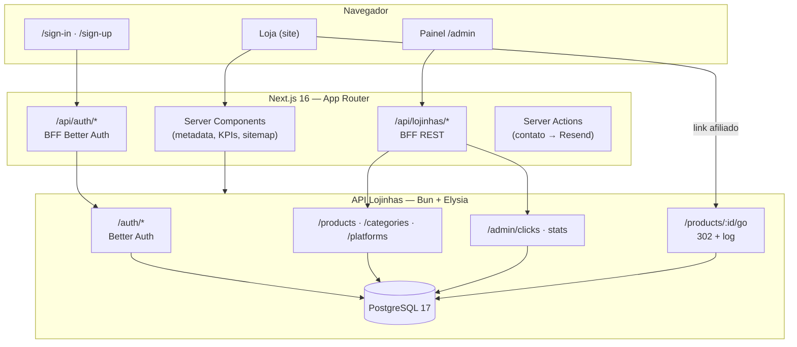

# Achadinho Preferido — Work Case (Portfólio)

> **Repositório:** `lojinha_produtos` (frontend)  
> **Produto:** [Achadinho Preferido](https://www.achadinhopreferido.com.br) — vitrine de afiliados com curadoria de ofertas (Shopee, Mercado Livre, Amazon, Magalu, AliExpress e outras plataformas).  
> **Papel deste repo:** aplicação **Next.js** que entrega a loja pública, autenticação, painel administrativo e proxies BFF para a API. O backend (Bun + Elysia + PostgreSQL) é um serviço separado; contrato documentado em `_agents-notes/backend-documentation.md`.

---

## Resumo executivo

O **Achadinho Preferido** é um negócio de **marketing de afiliados**: o site não processa pagamentos — ele **curadoria ofertas**, exibe preços e descontos, e encaminha o visitante para a loja oficial via link rastreado. Cada clique no CTA de compra passa por `GET /products/:id/go`, que registra analytics no servidor e redireciona (HTTP 302) para a URL de afiliado.

Este frontend foi construído como **produto completo**, não como landing estática: há **~226 arquivos TypeScript/TSX** e **~31.600 linhas** em `src/`, cobrindo vitrine responsiva com motion, busca e filtros avançados, favoritos locais, páginas institucionais, SEO (sitemap, JSON-LD, Open Graph), formulário de contato com e-mail transacional, e um **painel admin** com CRUD de catálogo, variantes com galeria de imagens, ações em lote, dashboard de KPIs, exploração de cliques com gráficos e exportação CSV.

A arquitetura prioriza **produção em hosts distintos** (ex.: Next na Vercel, API no Render): proxies **BFF** em `/api/auth` e `/api/lojinhas` reescrevem cookies de sessão para o domínio do site, permitindo que Server Components validem `admin` com `cookies()` — problema real que quebrava login em mobile/Safari quando o browser falava direto com a API.

---

## Contexto e problema

| Desafio | Como o projeto responde |
|--------|-------------------------|
| Catálogo dinâmico com muitos filtros e ordenações | TanStack Query + URL como fonte de verdade nos filtros; scroll infinito em `/ofertas` |
| Rastrear cliques sem expor PII na home | Endpoint público `GET /products/day-offer` (fuso `America/Sao_Paulo`) + fallback no servidor |
| Admin e loja no mesmo app, papéis distintos | RBAC `admin` \| `user` via Better Auth; layout `/admin` com `requireAdmin()` no servidor |
| API e frontend em origens diferentes | BFF que encaminha `Cookie` e sanitiza `Set-Cookie` (remove `Domain` da API) |
| Busca em português sem acento | Normalização NFD + remoção de diacríticos alinhada ao backend |
| Operadores precisam de produtividade | Formulário único create/edit (~2.300 linhas), bulk deactivate/delete, CSV de cliques |

---

## Modelo de negócio

1. **Curadoria** — equipe cadastra produtos com preço atual, preço original, categoria, plataforma, variantes (cor/tamanho) e imagens.
2. **Descoberta** — visitante navega home, categorias, busca, ofertas e detalhe do produto.
3. **Conversão** — CTA usa `<a href="{API}/products/{id}/go">` (nunca `fetch` para “simular” clique).
4. **Analytics** — admin vê log paginado, tendências, stats por produto e “oferta do dia” baseada em cliques reais.

---

## Arquitetura de alto nível



### Separação de responsabilidades

| Camada | Repositório / pasta | Responsabilidade |
|--------|---------------------|------------------|
| **Este repo** | `lojinha_produtos` | UI, BFF, SEO, estado cliente, formulários, tipos espelhando DTOs |
| **API** | Backend Lojinhas (externo) | Persistência, regras de negócio, redirect `/go`, OpenAPI em `/openapi` |
| **Infra** | Vercel + Render (típico) | `NEXT_PUBLIC_SITE_URL` vs `NEXT_PUBLIC_API_URL` |

---

## Stack tecnológica

### Frontend (este repositório)

| Área | Tecnologia | Uso no projeto |
|------|------------|----------------|
| Framework | **Next.js 16.2** (App Router) | Rotas em grupos `(site)`, `(auth)`, `admin`; RSC + client islands |
| UI | **React 19** | Componentes de loja e admin |
| Linguagem | **TypeScript 5** | Tipos em `src/types/api.ts` espelhando contrato da API |
| Estilo | **Tailwind CSS 4** + **shadcn/ui** (Radix) | Design system “cozy & warm” (cream, espresso, terracotta) |
| Tipografia | **Inter** + **Fraunces** | Sans para UI; heading serif na vitrine |
| Dados remotos | **TanStack Query v5** | Listas paginadas, mutations, invalidação via `qk` centralizado |
| Tabelas admin | **TanStack Table v8** | Produtos, categorias, cliques |
| Formulários | **React Hook Form** + **Zod 4** | Produto, auth, contato, create-admin |
| Auth cliente | **Better Auth** (`better-auth/react` + plugin admin) | `authClient` — **não** passa pelo `apiClient` |
| Motion | **Framer Motion / motion** | Hero, day-offer, trust bar, seções institucionais (~30 componentes) |
| Gráficos | **Recharts** | Tendência de cliques no dashboard e explorer |
| E-mail | **Resend** | Server Action do formulário de contato |
| Analytics | **Vercel Analytics** | Root layout |
| Qualidade | **ESLint** (`eslint-config-next`) + **Biome** (format) | Scripts `lint` e `format` |

### Backend (referência — não está neste repo)

| Camada | Escolha |
|--------|---------|
| Runtime | Bun |
| HTTP | Elysia |
| DB | PostgreSQL 17 (Docker Compose em dev) |
| ORM | Drizzle |
| Auth | Better Auth (email/senha + plugin admin) |
| Validação | Zod (handlers + OpenAPI) |

---

## Estrutura do repositório

```
src/
  app/
    (site)/              # Loja pública + header/footer
    (auth)/              # sign-in, sign-up (sem prefixo na URL)
    admin/               # Painel — protegido por layout server-side
    api/
      auth/[...path]/    # BFF Better Auth
      lojinhas/[...path]/ # BFF REST (admin, products, categories, platforms)
      internal/create-admin/  # Proxy opcional para criar admin
    internal/create-admin/    # UI ops (desabilitada por padrão)
    sitemap.ts, robots.ts
  components/
    site/                # Vitrine, cards, detalhe, institucional
    admin/               # Shell, CRUD, dashboard, cliques
    auth/                # Formulários de sessão
    ui/                  # Primitivos shadcn
  hooks/                 # use-products, use-clicks, use-session, …
  lib/
    api.ts, api-server.ts, auth.ts, auth-server.ts
    query-keys.ts, storefront-kpis.ts, product-search-query.ts
    format.ts, zod-errors.ts, click-csv.ts, legal-doc.ts
  types/api.ts           # Contrato tipado com a API
  content/legal/         # Markdown termos e privacidade
```

**Rotas públicas principais**

| Rota | Função |
|------|--------|
| `/` | Home: hero, trust bar, oferta do dia, destaques, recentes, prova social, como funciona |
| `/ofertas` | Catálogo completo com filtros e infinite scroll |
| `/busca` | Busca por texto (query `q`) |
| `/categorias`, `/categoria/[slug]` | Índice e listagem por categoria |
| `/achadinho/[slug]` | Detalhe do produto + relacionados + JSON-LD |
| `/favoritos` | Lista local (localStorage) |
| `/como-funciona`, `/quem-somos`, `/contato` | Institucional |
| `/politica-de-privacidade`, `/termos-de-uso` | Legal (Markdown parseado em seções) |

**Rotas admin**

| Rota | Função |
|------|--------|
| `/admin` | Dashboard: KPIs, produtos mais clicados, expirando, inativos, tendência |
| `/admin/products` | Lista com filtros, grid/tabela, seleção multi-página, bulk actions |
| `/admin/products/new`, `/admin/products/[slug]` | Criar / editar produto (variantes, specs, aviso legal) |
| `/admin/categories`, `/admin/platforms` | CRUD com sheets/dialogs |
| `/admin/clicks` | Explorer: filtros na URL, gráfico diário, tabela, export CSV |

---

## Loja pública — funcionalidades em detalhe

### Home e narrativa comercial

- **Hero** com animação (`hero-section-motion`) e produto em destaque calculado no servidor.
- **Trust bar** com KPIs derivados do catálogo público: quantidade de ofertas, maior desconto %, “usuários online” sintético (determinístico por janela de 10 min — sem backend de presença ainda) e economia total estimada.
- **Oferta do dia** (`DayOffer`): consome `GET /products/day-offer` com fallback em três níveis — (1) vencedor do dia em SP se ainda elegível no catálogo; (2) maior `clickCount` entre ativos; (3) produto mais recente. Implementação em `src/lib/storefront-kpis.ts` com `React.cache` para uma única passagem de catálogo por request.
- **Carrosséis** de destaques e produtos recentes; seção de prova social animada.
- **JSON-LD** `WebSite` + `SearchAction` na home para SEO de busca interna.

### Catálogo, busca e filtros

- Filtros sincronizados com a URL (`use-product-filters`): categoria, plataforma, faixa de preço, desconto mínimo, ordenação (`createdAt`, `currentPrice`, `discountPercent`, `clickCount`).
- **`/ofertas`**: `useProductsInfinite` — deduplicação por `id`, contador “carregar mais”, estados vazio/erro com componentes `Empty`.
- **Busca**: `normalizeProductSearchQuery` — NFD + strip de marcas combinantes + `toLocaleLowerCase('pt-BR')` antes de enviar `search=` à API (contrato exige o mesmo no servidor).
- **Cards de produto**: badge de desconto, plataforma, favorito, motion sutil no hover.

### Detalhe do produto (`/achadinho/[slug]`)

- **SSR** do produto + metadata dinâmica (title, description, canonical, OG/Twitter com imagem).
- **Variantes**: galeria por variante selecionada; variante default define `imageUrl` da listagem.
- **CTA de afiliado**: link real para `{API_BASE_URL}/products/{id}/go` — preserva comportamento de redirect e logging.
- **FOMO**: barra visual derivada de `clickCount` (função não linear para não saturar).
- **Countdown** quando `expiresAt` está definido.
- **Abas**: descrição, especificações, aviso legal (placeholders estáticos quando API não envia).
- **Relacionados**: merge de até 12 produtos das categorias vinculadas, ordenados por cliques.
- **Favoritos**: `FavoriteToggle` + `useSyncExternalStore` em cima de `localStorage` (sem backend ainda; múltiplas instâncias do hook sincronizadas).

### Páginas institucionais

- **Como funciona**: fluxo em passos, FAQ accordion, seções de transparência, segurança e cobertura — conteúdo em dados TS + motion.
- **Quem somos**: timeline, princípios, depoimentos em carrossel, KPIs estáticos, CTA.
- **Contato**: seletor de intenção (suporte, parceria, sugerir oferta), horário comercial, links de suporte por marketplace (`platform-buyer-support`), formulário validado com Zod, **Server Action** enviando HTML/texto via **Resend** para `atendimento@achadinhopreferido.com.br`.

### SEO e descoberta

- `metadataBase` via `NEXT_PUBLIC_SITE_URL` (fallback `VERCEL_URL`).
- **`sitemap.ts`**: revalidação 1h; páginas estáticas + todas categorias + todos produtos do catálogo público.
- **`robots.ts`**: bloqueia `/admin`, auth e `/internal`.
- Admin com `robots: { index: false }` no layout.

---

## Painel administrativo — funcionalidades em detalhe

### Proteção e shell

- `app/admin/layout.tsx`: `dynamic = "force-dynamic"`, `requireAdmin()` antes de renderizar qualquer filho.
- **`AdminShell`**: sidebar fixa (desktop) + drawer (mobile), breadcrumbs, toggle de tema escuro, chip do usuário vindo do servidor (evita flash de `useSession` na hidratação).
- Link “Ir para a loja” e sign-out integrados.

### Dashboard (`/admin`)

| Widget | Fonte de dados |
|--------|----------------|
| KPI tiles | Contagens `GET /products` (ativo vs total), `GET /admin/clicks` com `from` para 24h/7d, scan client-side de expiração em 7 dias |
| Mais desejados | Produtos ordenados por `clickCount` |
| Expirando em breve | Filtro `expiresAt` na janela |
| Inativos | Lista para reativação |
| Top categorias | Métricas agregadas |
| Tendência de cliques | Recharts — série temporal |

Cada tile **degrada independentemente** (skeleton / “—”) se um endpoint falhar.

### Produtos

- **Lista**: filtros admin (`includeInactive=true`), paginação, alternância grid/lista (`use-view-mode`), seleção persistente entre páginas.
- **Bulk actions**: desativar em paralelo (`PATCH isActive: false`) ou excluir com confirmação digitando a quantidade; `Promise.allSettled` + toasts de sucesso/parcial.
- **Formulário unificado** create/edit:
  - Espelha `CreateProductBody` / `UpdateProductBody` da API.
  - Variantes com `useFieldArray`: label, ordem, `isDefault`, múltiplas imagens por variante.
  - Múltiplas categorias com primária em índice 0.
  - Validação de `originalPrice >= currentPrice` antes do POST.
  - Matriz de erros HTTP: 401/403 → redirect sign-in; 409 → campo slug; 400 → mapeamento heurístico; 422 → `parseApiErrors` + `applyErrorsToForm`.
  - `beforeunload` para alterações não salvas.
  - Dialogs inline para criar categoria/plataforma sem sair do fluxo.
- **Stats por produto**: painel com `GET /admin/products/:id/stats` (24h, 7d, 30d, total).

### Categorias e plataformas

- CRUD com tabelas/grids, sheets de formulário, exclusão com confirmação (FK restrict se houver produtos).
- Campos de storefront: `cardTitle`, `imageUrl` em categorias; `supportUrl` e `logoUrl` em plataformas.

### Cliques (`/admin/clicks`)

- Filtros na URL: produto, intervalo `from`/`to`, paginação.
- Gráfico de barras diário (`useClicksRange`) + tabela paginada (`useClicks`).
- **Export CSV** do intervalo filtrado (`buildClicksCsv` + download client-side).
- Mapa `productId → title` para legibilidade (`useProductsIdMap`).

---

## Autenticação, autorização e segurança

### Better Auth

- Cliente: `authClient` com `basePath: "/api/auth"` e `baseURL` = origem do site.
- `disableDefaultFetchPlugins: true` — evita redirect automático do plugin Better Auth que causava “Failed to fetch” no sign-in quando o browser abortava a navegação.
- Sign-in/sign-up com tratamento de erro **sem enumerar usuário** (mensagem genérica em credenciais inválidas).

### RBAC

| Papel | Acesso |
|-------|--------|
| `admin` | Painel, writes em catálogo, `/admin/*` |
| `user` | Loja logada; chamadas admin retornam **403** |

Bootstrap: **primeiro usuário** do banco vira `admin` no sign-up; demais são `user`. Provisioning extra via `POST /internal/_ops/create-admin` (secret no body, nunca em `NEXT_PUBLIC_*`).

### BFF e cookies

**Problema resolvido:** sessão emitida no domínio da API não chegava à Vercel → `requireAdmin` sempre redirecionava.

**Solução:**

1. `app/api/auth/[...path]/route.ts` — proxy para `{API}/auth/*`, reescreve `Set-Cookie` removendo `Domain` da API.
2. `app/api/lojinhas/[...path]/route.ts` — proxy restrito a `admin`, `products`, `categories`, `platforms`; encaminha `Cookie` do browser para upstream.

No browser, `apiClient` prefixa esses segmentos com `/api/lojinhas` (`ADMIN_API_BROWSER_PREFIX`).

### Rota interna create-admin (ops)

- Habilitada só com `ALLOW_CREATE_ADMIN_ROUTE=true`.
- Opcional: `CREATE_ADMIN_ROUTE_BEARER_TOKEN` no header `Authorization`.
- UI em `/internal/create-admin`; handler em `POST /api/internal/create-admin` — **404** por padrão em produção.

---

## Camada de dados e contrato com a API

### Cliente HTTP

- `api()` / `apiClient`: `credentials: "include"`, `ApiError` tipado, suporte a `searchParams` e body JSON, `204` → `undefined`.
- `apiServerGet`: mesmo contrato no servidor + forward de `Cookie` + `cache: "no-store"` por padrão.

### React Query

- Chaves centralizadas em `src/lib/query-keys.ts` — convenção `domain.list(filters)`, `domain.one(id)`.
- Defaults: `staleTime` 30s, sem retry em 4xx.
- Invalidação após mutations em produtos, categorias, plataformas e cliques.

### Tipos

- `src/types/api.ts` — espelho manual dos DTOs; mudanças na API devem quebrar compile-time de propósito.
- Entidades principais: `Category`, `Platform`, `ProductListItem`, `ProductDetail` (com `variants[]`, `specifications`, `legalWarning`), `Click`, `ProductStats`, `DayOfferResponse`, `Paginated<T>`.

---

## Design e experiência

### Identidade visual (loja)

- Paleta **warm cream** (`#f7f5f2`), texto **espresso** (`#2c1f1a`), CTA **terracotta**.
- Loja força tema claro: classe `.light` no layout `(site)` e variante Tailwind customizada para que portais Radix (dropdown, dialog) não herdem `dark` do admin.
- Admin suporta **dark mode** via `@teispace/next-themes`.

### Motion e polish

- Animações com Framer Motion em hero, oferta do dia, trust bar, sliders, páginas internas — reforço de hierarquia sem bloquear conteúdo (progressive enhancement).
- Componentes reutilizáveis: `ProductCard`, `OfferCarousel`, `MorphingCardStack` para categorias em destaque.

### Acessibilidade e UX

- Breadcrumbs e `aria-label` em navegação.
- Estados `Empty`, `Skeleton`, toasts **Sonner** com tema sincronizado.
- Formulários com labels, descrições e mensagens por campo (Zod + API).

---

## Decisões técnicas destacáveis (para entrevista / portfólio)

1. **BFF duplo (auth + REST)** — escolha pragmática para multi-domínio em produção, documentada inline nos route handlers com o “porquê” histórico (Render + Vercel).

2. **Day-offer sem vazar admin** — a home não usa `/admin/clicks` (exigiria cookie); usa endpoint público agregado com timezone explícito e fallback documentado.

3. **Affiliate `/go` só via `<a>`** — respeita semântica de navegação, SEO e garante log no servidor; evita anti-padrão de `fetch` para clique.

4. **Catálogo cacheado por request** — `getStorefrontCatalog` com `React.cache` alimenta KPIs, hero e day-offer sem N+1 desnecessário na mesma renderização.

5. **Favoritos com `useSyncExternalStore`** — padrão React recomendado para `localStorage` sem warnings de `setState` em `useEffect`.

6. **Formulário de produto como single source** — um componente para create/edit reduz divergência de validação; diff no PATCH envia só campos alterados.

7. **Query keys como contrato de invalidação** — escala melhor que strings soltas quando o time cresce.

8. **Legal como Markdown versionado** — `src/content/legal/*.md` parseado em seções com IDs estáveis para âncoras e e-mail de contato extraído.

---

## Integração e ambiente

| Variável | Papel |
|----------|--------|
| `NEXT_PUBLIC_API_URL` | Origem HTTP da API (sem sufixo `/api`) |
| `NEXT_PUBLIC_SITE_URL` | Canonical, OG, sitemap, `metadataBase`, Better Auth `baseURL` |
| `ALLOW_CREATE_ADMIN_ROUTE` | Habilita proxy/UI de create-admin |
| `CREATE_ADMIN_ROUTE_BEARER_TOKEN` | Bearer opcional no proxy |
| Resend (contato) | Chave no ambiente do deploy (não commitada) |

**Scripts:** `npm run dev` · `build` · `start` · `lint` · `format` (Biome).

**Deploy típico:** Vercel para Next; API em Render ou VPS; CORS/`trustedOrigins` do Better Auth devem incluir o domínio da loja.

---

## Métricas do codebase (referência)

| Métrica | Valor aproximado |
|---------|------------------|
| Arquivos `.ts` / `.tsx` em `src/` | ~226 |
| Linhas em `src/` | ~31.600 |
| Rotas `page.tsx` | 22 |
| Hooks de dados customizados | 11 |
| Proxies BFF | 2 (`auth`, `lojinhas`) |

---

## O que demonstra este projeto (pitch para recrutador)

- **Full-stack frontend sênior:** App Router, RSC, Server Actions, tipos alinhados a API real, não mock.
- **Produto digital B2C:** funil de afiliado, urgência (countdown, FOMO), SEO de e-commerce.
- **Painel interno completo:** CRUD complexo (variantes/imagens), analytics, export, bulk ops.
- **Auth em produção cross-origin:** BFF, cookies, RBAC server-first.
- **Qualidade operacional:** tratamento de erros HTTP por status, degradação graceful, robots/sitemap, analytics Vercel.

---

## Evoluções naturais (não implementadas ou parciais)

Úteis para mostrar visão de produto sem desvalorizar o que já existe:

- Favoritos persistidos no backend (hoje: `localStorage`).
- Middleware Next para `next` deep-link pós-login no admin.
- Filtro server-side “expira em N dias” em vez de scan client-side no KPI.
- Busca multi-token (documentada em notas; API pode evoluir além de substring).
- Testes E2E (Playwright) no fluxo sign-in → criar produto → `/go`.
- PWA / notificações de queda de preço.

---

## Links e documentação interna

| Documento | Conteúdo |
|-----------|----------|
| `README.md` | Setup, env, layout do repo |
| `_agents-notes/backend-documentation.md` | Contrato HTTP completo, auth, paginação, erros, cookbook TanStack Query |
| `src/types/api.ts` | Tipos consumidos pelo frontend |
| OpenAPI (API) | `GET /openapi` no backend em dev |

---

## Frases prontas para o portfólio (copy-paste)

**Título sugerido:** Achadinho Preferido — vitrine de afiliados e painel de curadoria

**Uma linha:** Next.js 16 e React 19 para uma loja de achadinhos com rastreamento de cliques, SEO e admin completo integrado a API Bun/Elysia via BFF.

**Parágrafo curto:** Desenvolvi o frontend do Achadinho Preferido, plataforma de curadoria de ofertas de marketplaces brasileiros. A loja combina busca accent-insensitive, filtros avançados, detalhe de produto com variantes e redirect de afiliado instrumentado; o painel permite gerenciar catálogo, analisar cliques e exportar dados. A arquitetura usa proxies BFF para sessão HttpOnly entre domínios, Server Components para SEO e TanStack Query para estado servidor-cliente consistente.

**Bullets para LinkedIn:**
- Loja pública + admin RBAC no mesmo monorepo frontend (~31k LOC TS)
- BFF `/api/auth` e `/api/lojinhas` para cookies cross-domain (Vercel + API externa)
- Dashboard com KPIs, gráficos Recharts e export CSV de cliques
- Formulário de produto com variantes, galerias e validação espelhando Zod da API
- SEO: sitemap dinâmico, JSON-LD, Open Graph por produto

---

*Documento gerado para uso em portfólio. Atualize URLs e métricas após deploys significativos.*
